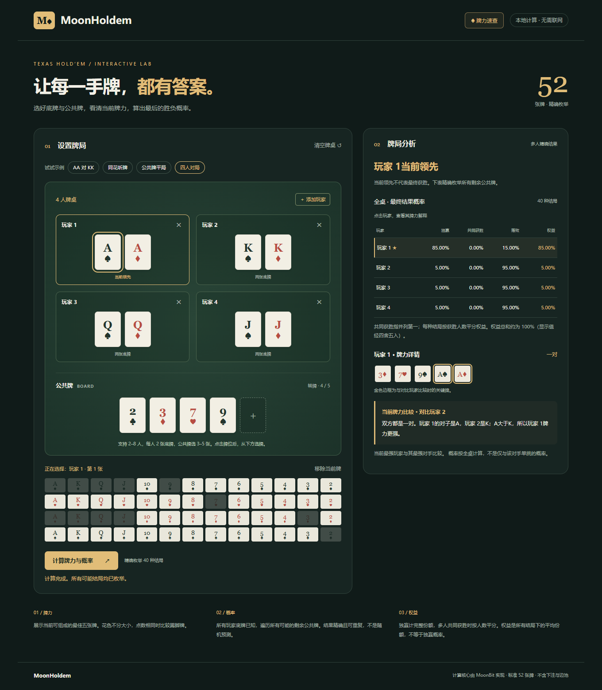

# Poker Lab

一个由 Ryan 制作的德州扑克牌局分析工具。选好玩家底牌与公共牌，查看当前最佳五张、全桌胜负概率，以及哪些河牌会改变结果。支持浏览器和可离线使用的 Android APP。

[在线体验](https://ryan-1125.github.io/PokerLab/) · [Android 安装与构建](docs/ANDROID.md) · [计算核心 API](https://mooncakes.io/docs/Ryan-1125/moonholdem)



## 能做什么

- 支持 2–9 人牌桌、自定义玩家名字，以及八个典型牌局示例。
- 手动选牌、随机发一张，或一键补齐底牌，再补齐公共牌；双击已选牌可移除。
- 牌池可切换完整布局与分色布局。分色模式按 2–9、10–A 分两行展示，记住布局和花色选择。
- 分析当前牌型、最佳五张、独赢概率、共同获胜概率、落败概率和权益。
- 转牌阶段列出不同河牌的结果，点击河牌可继续分析，并返回原来的转牌局面。
- 提供牌力速查、关键牌强调、翻牌与发牌动画，以及适合手机的常驻导航。
- 牌局图片支持预览、确认保存，导出宽度为 4000 像素的 PNG。

所有玩家底牌必须已知，分析需要至少三张公共牌。概率来自剩余公共牌的精确枚举；权益是共同获胜时平分份额后的平均值，不等于独赢概率。本项目不包含下注、弃牌、边池、未知手牌范围或策略推荐。

## 开始使用

网页中先选牌位，再选牌，或展开“试试示例”载入牌局。点击“分析牌局”后，可点击结果表的玩家行查看对应详情。

网页新进入时是空白二人牌桌，当前标签页刷新会恢复牌局；APP 会在设备本地保存并恢复牌局。数据无需上传服务器。点击左上角品牌可刷新，图片保存前会先弹出预览。

Android 安装包由本地构建生成，当前版本为 **0.1.3**。已有相同签名的旧版可直接覆盖安装。APK 的网页资源和计算引擎都包含在安装包内，使用时不依赖电脑上的本地服务。安装步骤见 [Android 文档](docs/ANDROID.md)。

## 本地运行网页

需要 MoonBit 编译器（`moonc >= 0.10.14`）及 Node.js。建议使用 Node.js 22 或更高版本，以便同时运行 Android 构建工具。

```sh
node scripts/serve-web.mjs
```

打开 <http://127.0.0.1:4173/>。脚本会构建计算引擎并启动服务，网页预览本身无需安装 npm 依赖。使用期间保持终端运行，按 `Ctrl+C` 停止；直接双击 HTML 文件不能替代本地服务。

## 技术实现

网页使用 HTML、CSS 和 JavaScript 实现交互，MoonBit 核心通过 JavaScript 接口在 Web Worker 中计算，避免阻塞界面。Android 使用 Capacitor 复用网页资源，并提供系统文件保存和返回键适配。

五张牌通过点数计数、同花与顺子判断进行排序；七张牌枚举 21 个五张组合选出最强牌。胜负概率枚举剩余公共牌的无序组合，按每种结局的获胜玩家累计次数与权益。

界面品牌为 Poker Lab，代码仓库和计算库保留 MoonHoldem 命名。核心库可独立使用：

```moonbit nocheck
// 在使用方包中导入 Ryan-1125/moonholdem，别名为 holdem。
let cards = @holdem.parse_cards("As Ad Ah Ks Kd Kh 2c").unwrap()
let hand = @holdem.evaluate(cards).unwrap()
// hand.category 为 FullHouse，hand.tie_break 为 [14, 13]。
```

双人概率接口为 `exact_equity(hero, villain, board)`，多人接口为 `exact_table_equity(hands, board)`。牌面使用 `As`、`Kh`、`Td`、`2c` 等记法；完整示例见 `cmd/demo`。

## 检查与构建

```sh
moon check --deny-warn
moon build --deny-warn
moon test --deny-warn
moon run cmd/demo
node scripts/build-web.mjs
node scripts/test-web.mjs
```

可使用以下命令遍历全部 2,598,960 种五张牌组合，校验九种牌型计数：

```sh
moon run cmd/verify --release
```

浏览器回归测试与 Android 打包需要 npm 依赖：

```sh
npm ci
npm run build:app
npx playwright install chromium
npm run test:app
npm run android:apk
```

Android 构建还需要 JDK 21 和 Android SDK 36，详见 [构建说明](docs/ANDROID.md)。APK 输出到 `artifacts/`；签名文件保存在 `.local/android-signing/`，应私下备份并保留，供后续覆盖更新使用。安装包和签名文件不提交到仓库。

GitHub Actions 中包含核心检查、构建、测试和网页部署流程，Android 工作流可生成测试构建。浏览器的原生桥接测试使用模拟接口，不替代手机实测。

## 主要目录

| 路径 | 用途 |
| --- | --- |
| `cards.mbt`、`evaluator.mbt` | 牌面校验、牌型评估与最佳五张 |
| `holdem.mbt`、`multiplayer.mbt` | 摊牌与精确概率 |
| `explanation.mbt` | 比较说明与关键牌 |
| `web/`、`web_bridge/` | 网页与计算接口 |
| `mobile/`、`android/` | Android 适配与工程 |
| `cmd/demo/`、`cmd/verify/` | 可运行示例与穷举验证 |
| `scripts/` | 构建、预览与回归检查 |
| `images/`、`docs/` | 截图与文档 |

## 许可证

采用 [MIT License](LICENSE)。扑克牌规则计算按通用德州扑克规则实现。
